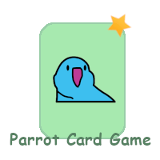
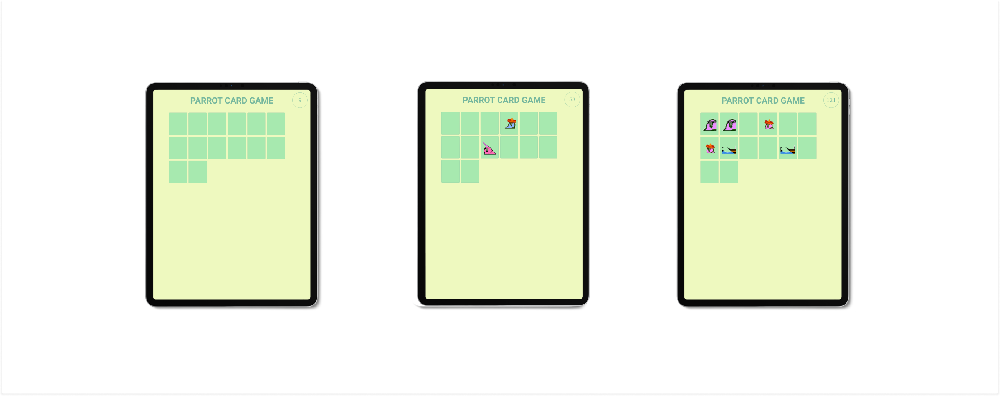

<p align="center">
  <a href="https://raferdev.github.io/parrots-cardgame/">
 </a>
</p>

<h3 align="center">Parrots Card Game</h3>

<div align="center">

[]()
[](https://github.com//raferdev/parrots-cardgame/issues)
[](https://github.com/raferdev/parrots-cardgame/pulls)
[](/LICENSE)

</div>

---



<p align="center"> This is a HTML + CSS + Javascript project based on a simply memory game, with focus on training javascript logic and CSS 3D animations.
</p>

## 📝 Table of Contents

- [About](#about)
- [Getting Started](#getting_started)
- [Usage](#usage)
- [Built Using](#built_using)
- [Authors](#authors)

## 🧐 About <a name = "about"></a>

This project i use to training the Javascript logic. I had to integrate logic with CSS styles to memory game work and have to show the animation of card spinning.

## 🏁 Getting Started <a name = "getting_started"></a>

You can clone the project and start on your local host or open the site hospeded <a href="https://raferdev.github.io/parrots-cardgame/">here</a>

Clone

 ```
 git clone https://github.com/raferdev/instagram
 ```

## 🎈 Usage <a name="usage"></a>
- First you can set the initial value of card, between 4 and 14. 
- Now you can click on one card and see which parrot are there. And you can select two cards.
- If the two cards are of the same parrot, its keep face up, else the cards turn over.
- When all the cards are face up, the game shows a alert with the seconds count of the match.
- You can type 'Sim' to keep playing or 'Não' to end game.

## ⛏️ Built Using <a name = "built_using"></a>

- [HTML](https://developer.mozilla.org/pt-BR/docs/Web/HTML) - Markup Language
- [CSS](https://developer.mozilla.org/pt-BR/docs/Web/CSS) - Style Language
- [JS](https://developer.mozilla.org/pt-BR/docs/Web/javascript) - Interative Language

## ✍️ Authors <a name = "authors"></a>

- [@raferdev](https://github.com/raferdev) - Idea & Initial work